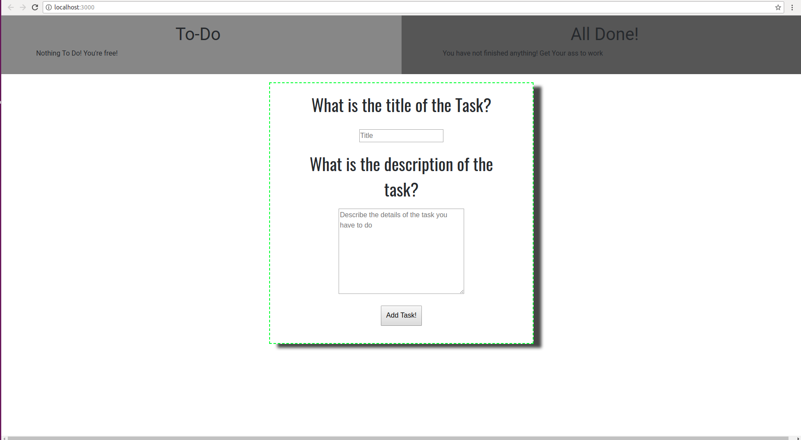

# To Do List
> Small To Do List made using React JS.


You can add a task along with the description, and tick off tasks that are done. You can untick tasks from the 'Done' list as well.



## Development setup

Set up the environment using the commands below.

Inside the to-do folder, execute the following commands.
```sh
yarn install
yarn start
```


## Contribution

If you found this repo useful, star it.

